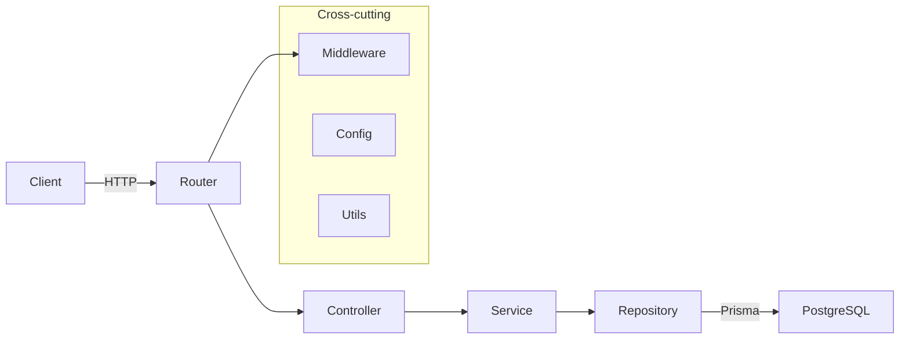
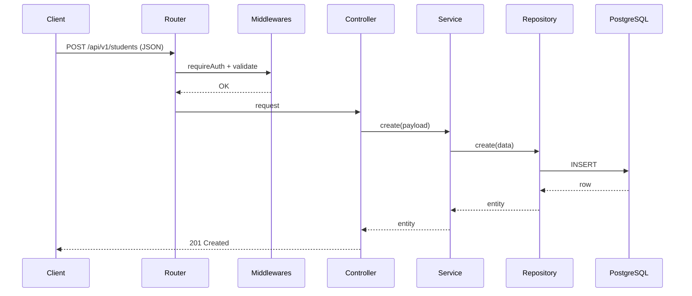

# Software Design Document (SDD)

## 1. Overview
Talabalar Ro'yhati API uch qatlamli arxitektura bilan qurilgan:
- Router → Controller → Service → Repository → DB (Prisma)
- Kross-cutting: `middlewares/` (auth, validate, error), `utils/`, `config/`

## 2. Architecture

## 3. Modules
- `src/routes/` – marshrutlar: `students.route.ts`, `auth.route.ts`, `health.route.ts`
- `src/controllers/` – HTTP kirish/chiqish boshqaruvi, `studentsController`
- `src/services/` – biznes qoidalar: `studentsService` (CRUD, CSV import/export)
- `src/repositories/` – ma’lumot qatlam: `studentsRepo` (Prisma CRUD, `createMany`)
- `src/middlewares/` – `auth.ts` (JWT), `validate.ts` (Zod), `errorHandler.ts`, `upload.ts` (multer)
- `src/config/` – `env.ts` (`dotenv`)
- `src/utils/` – `pagination.ts`, `logger.ts`

## 4. Data Model
Student (`prisma/schema.prisma` bilan mos):
- `id: string (uuid)`
- `full_name: string`
- `faculty: string`
- `group: string`
- `email?: string`
- `phone?: string`
- `birth_date: Date`
- `enrollment_year: number`
- `status: enum('active','graduated','expelled','academic_leave')`
- `created_at: Date`
- `updated_at: Date`

Index/unique (tavsiya):
- `faculty`, `group`, `status` ustiga indeks
- `email` uchun `@unique?` (biznes qoidaga qarab)

## 5. Request Flow (Create)

## 6. CSV Import Flow
- Upload: `multer` (memoryStorage, 5MB, CSV-only)
- Parse: `csv-parse/sync` (`columns: true`, `trim`, `skip_empty_lines`)
- Validate: `createStudentSchema` (Zod)
- Persist: `studentsRepo.bulkCreate(valid)` (`createMany`, `skipDuplicates: true`)
- Response: `{ inserted, invalid, errors[] }`

## 7. Security
- JWT Bearer (`/api/v1/auth/login`), `.env: JWT_SECRET`
- Helmet va CORS yoqilgan
- Protected: `POST/PATCH/DELETE /students`, `POST /students/import`

## 8. Error Handling
- `errorHandler` – standart JSON `{ error: { message, code } }`
- Validation xatolari: 400, Auth: 401, NotFound: 404

## 9. Configuration
- `config/env.ts` → `PORT, DATABASE_URL, JWT_SECRET, ADMIN_USERNAME, ADMIN_PASSWORD`
- OpenAPI 3.1.0 (`openapi.yaml`)

## 10. Testing
- Jest + Supertest
- Testlar: `tests/auth.test.ts`, `tests/students.test.ts`
- `jest.config.ts`, `tests/setup-env.ts`

## 11. Performance & Scale
- Pagination (limit ≤ 100)
- Indexlar bilan qidiruvlar tezlashadi
- Katta CSV’lar uchun keyinchalik: streaming/queue, progress

## 12. Deployment Guidelines
- Build: `npm run build` + `npx prisma generate`
- Start: `npx prisma migrate deploy && node dist/server.js`
- Docker/Render/Railway uchun ENV’lar: `DATABASE_URL`, `JWT_SECRET`, `PORT`
